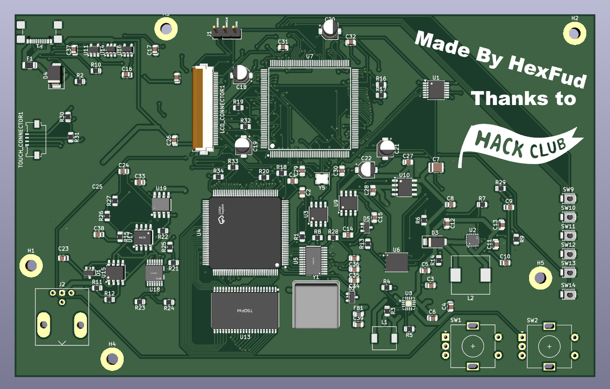
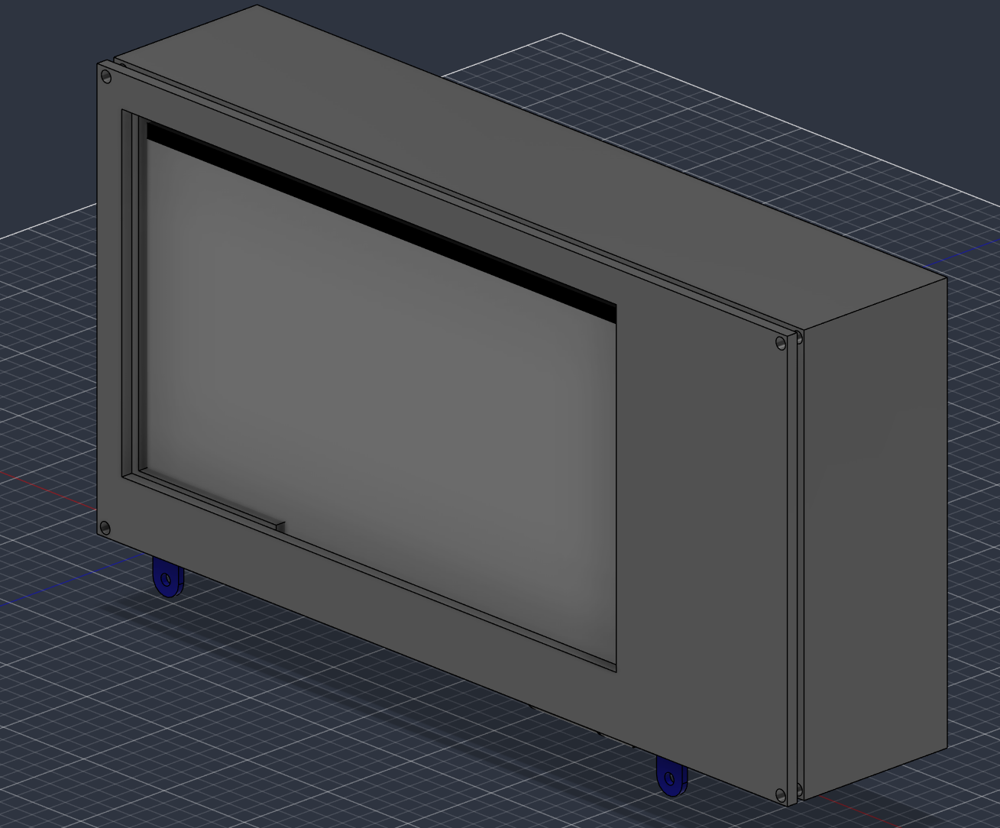
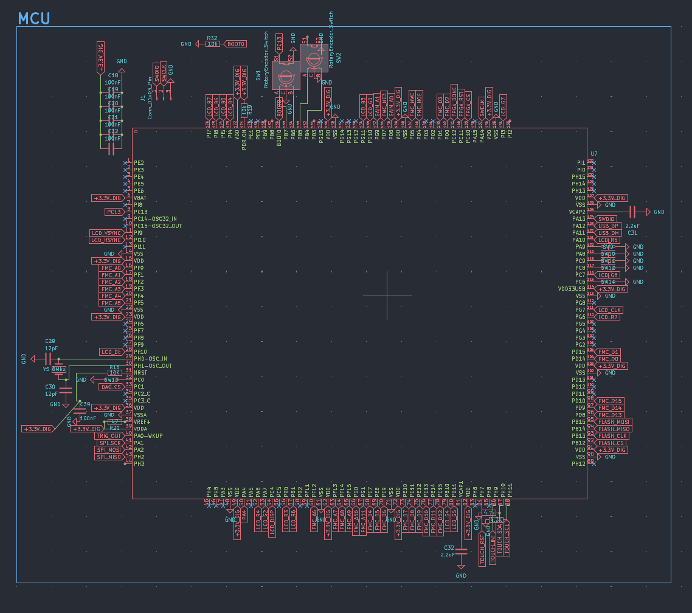
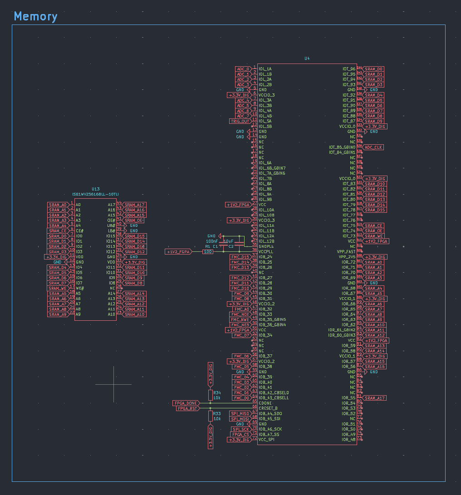
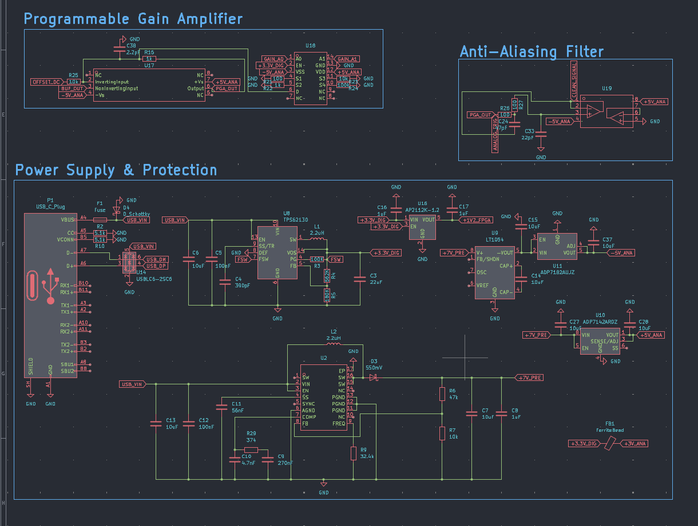
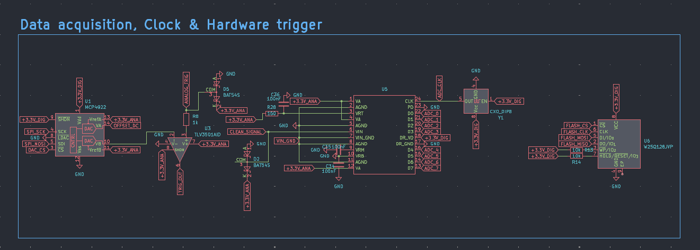
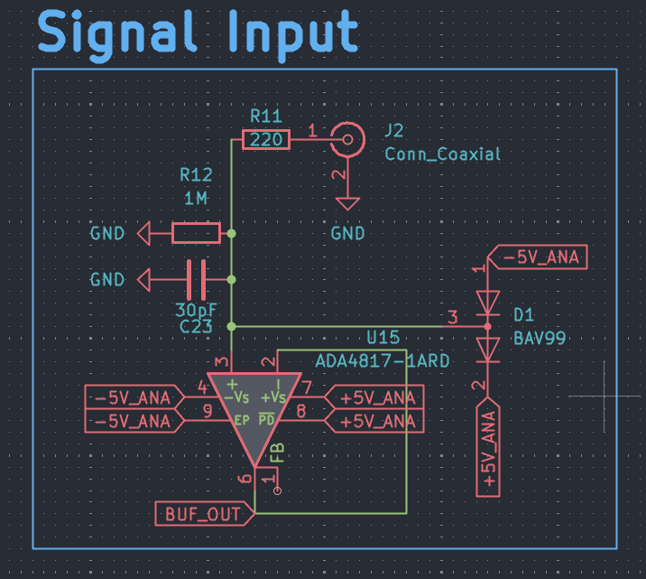
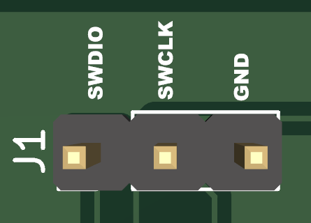

# stm32-fpga-oscilloscope
I created a 1-Channel 20MHz 100MS/s Mixed-Signal Digital Storage Oscilloscope on a custom 4-layer PCB. Powered by STM32H7, Lattice iCE40 FPGA, and USB-C from scratch!

## Schematic and Routing

## How this was made

I have designed the PCB starting from an STM32H7 microcontroller because of its support for external SRAM and it can directly control the main 7 Inch display with high speed transmission data. The entire board runs using a single 5V usb-C connection and then internally this becomes 3.3V, 1.2V and ±5V. The board includes connections for:
- A standard BNC input for oscilloscope probes (1MΩ impedance)
- 2 Rotary encoders and 6 tactile buttons for UI navigation
- A 40-pin FPC socket for an RGB LCD display with a dedicated capacitive touch connector.

## Specifications

| Parameter | Value |
| :--- | :--- |
| Channels | 1 analog |
| Analog bandwidth | 20 MHz |
| Sample rate | 100 MS/s |
| Input | BNC, 1 MΩ, x1 / x10 probes |
| Processing | STM32H7 + Lattice iCE40 FPGA |
| Display | 7" 800x480 RGB LCD, capacitive touch |
| User input | 2 rotary encoders, 6 buttons, touchscreen |
| Power / data | USB-C, 5 V |
| PCB | Custom 4-layer |

## Firmware
The firmware runs on the STM32H7 and is built with STM32CubeIDE and the STM32 HAL. It is responsible for acquisition control, trigger handling, signal processing, rendering the waveform and handling the user interface.

## Display and UI

- Waveform area with a graticule (grid) and a measurement/status bar
- Frame buffer in memory, redrawn on every new acquisition **TODO**
- Controls: one encoder for time base, one for volts/div, buttons for run/stop, single, trigger mode, etc.
- Touchscreen for menus and cursors **TODO:**

## External connections

1. USB-C Power and Data (P1) this port powers the entire board and it is protected against ESD via a dedicated USBLC6-2SC6 chip
2. Signal Input (J2) It allows you to connect standard x1/x10 oscilloscope probes to measure
3. Programming Port (J1)  Has 3 pins dedicated to flashing and debugging the STM32 microcontroller

| Pin | Function | Where to connect (ST-Link) |
| :---: | :--- | :--- |
| **1** | `SWDIO` | ST-Link SWDIO |
| **2** | `SWCLK` | ST-Link SWCLK |
| **3** | `GND` | ST-Link GND |

## How to flash the firmware

My project uses an STM32H7 chip. To flash the firmware you need an ST-LINK V2 where you need to wire up the correct cable from the usb to the board (J1 connector) and download the free software [STM32CubeProgrammer](https://www.st.com/content/st_com/en/stm32cubeprogrammer.html) and you simply need to upload the firmware.

Steps to reproduce (note that you need to do both):

In STM32CubeIDE:

1. Install STM32CubeIDE
2. Open the project folder inside the IDE
3. Let the IDE resolve the HAL dependencies
4. Go to Project -> Build All to compile the code
5. Wait for the compilation to finish and locate the generated `.bin` or `.elf` file in the `Debug` folder.

In STM32CubeProgrammer:

1. Install the software from the link above
2. Insert the ST-Link V2 USB into the pc
3. Connect the pins explained above (you can power the board via the USB-C port while flashing)
4. In STM32CubeProgrammer ensure that ST-LINK is selected and click connect
5. Go in the erasing & programming tab and select the previously exported `.bin` file
6. Click start programming and if everything went right you'll see Download verified successfully

## Filament reccomendation

Because linear regulators (LDOs) and the FPGA generate heat during continuous high-speed sampling, I strongly reccomend to use filaments like PETG, ABS or ASA instead of standard PLA ensuring the plastic won't soften, warp or melt during intensive usage.

## ⚠️⚠️ Safety advice ⚠️⚠️

This project includes experimental software, hardware designs, and assembly documentation are still under development and may contain bugs, errors, or incomplete features. By using, building, or modifying this project, you acknowledge that:

1\. You use this project entirely at your own risk
2\. You are solely responsible for safe assembly, testing, and operation
3\. The autor isn't responsible for any type of damage, injury or loss to people or the machine itself

By proceeding, you accept all risks and agree to these conditions. If you do not acknowledge these risks and conditions, please do not use or build this project.
